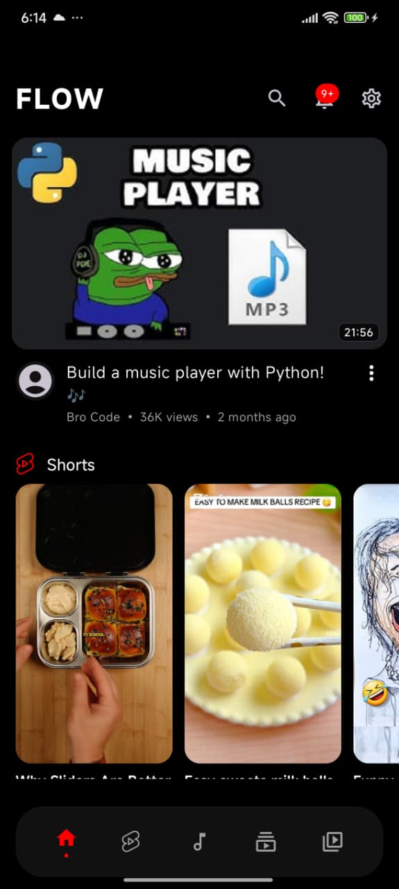
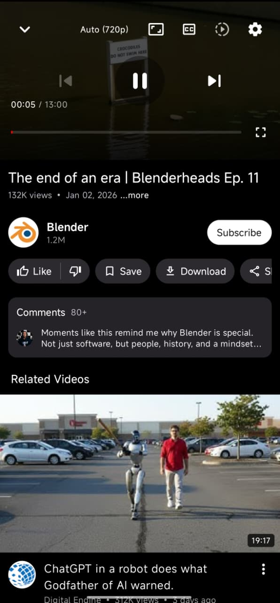
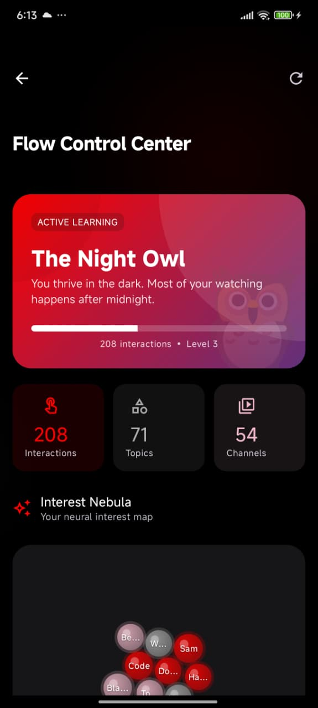
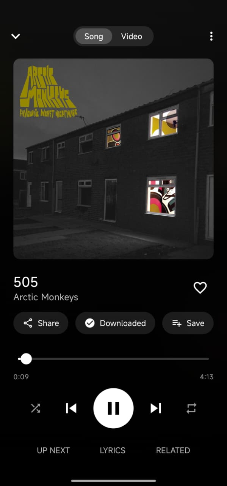
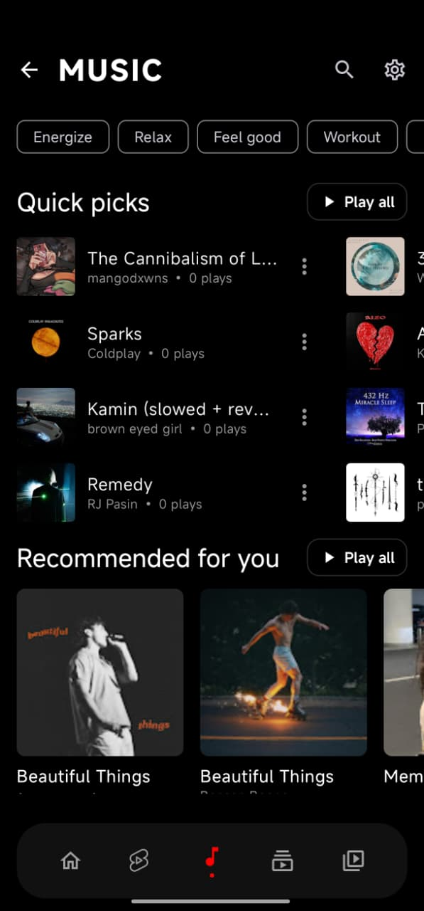
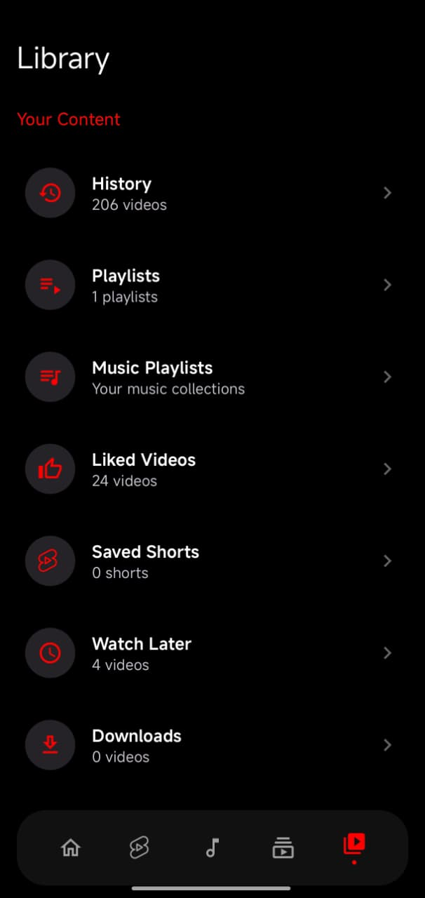
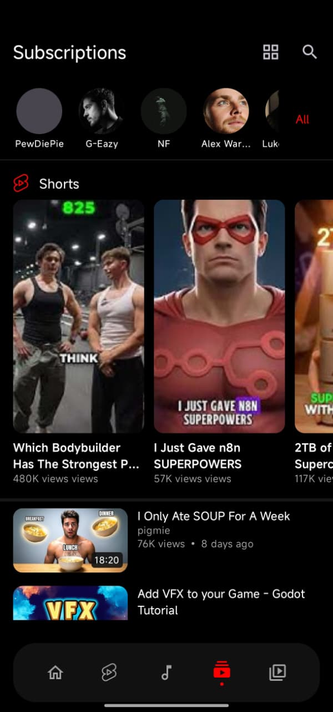
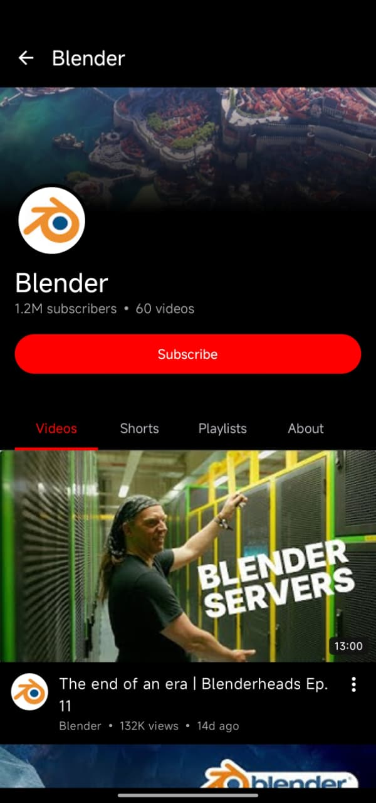
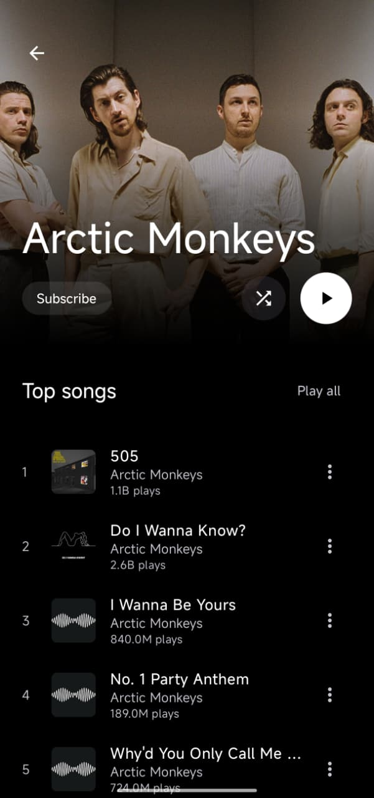

# Flow

  
    
  
  

 
<!-- Downloads & Version (Social Proof) -->

 

<!-- Tech Stack -->

 

<!-- Community & License -->

    
  
  <h3><b>The First Privacy-Focused Client That Actually Learns.</b></h3>
  

    Flow is a modern, Material 3 YouTube client built with Jetpack Compose. 
    It features <b>FlowNeuro™</b>, a local-only recommendation engine that adapts to your taste without tracking you.
  

  
  

    <a href="https://github.com/A-EDev/Flow/releases"><b>📥 Download APK</b></a> • 
    <a href="https://github.com/A-EDev/Flow/wiki"><b>📚 Documentation (Wiki)</b></a> • 
    <a href="#support--donations"><b>❤️ Donate</b></a>
  

---

## ✨ Why Flow?

Most open-source clients focus purely on playback. Flow focuses on discovery.

### 🧠 FlowNeuro™ Engine
Google relies on server-side tracking. Flow relies on client-side vector analysis.
*   **On-Device Intelligence:** A vector-based engine runs locally on your phone to learn what you like.
*   **Transparent Algorithm:** Visualize your "Cognitive Map" in settings. See exactly why a video was recommended.
*   **Context Aware:** Flow knows you like Lofi in the morning and Gaming at night.

### 🎨 Uncompromising Aesthetics
*   **100% Jetpack Compose:** Smooth animations, predictive back gestures, and zero lag.
*   **11+ Premium Themes:** From OLED Black to Ocean Blue and Sunset Orange.
*   **Seamless Playback:** 4K video, background play, and Picture-in-Picture (PiP) work out of the box.

### 🔒 Privacy First
*   **No Google Account Needed:** Your data lives in a JSON file on your device.
*   **No Tracking:** No ads, no analytics, no server-side surveillance.
*   **Total Control:** Export your data or nuke your recommendation brain instantly.

---

## 📸 Screenshots

  <table>
    <tr>
      <td align="center"><b>Home Feed</b> </td>
      <td align="center"><b>Video Player</b> </td>
      <td align="center"><b>Personality Screen</b> </td>
    </tr>
    <tr>
      <td align="center"><b>Music Player</b> </td>
      <td align="center"><b>Music Hub</b> </td>
      <td align="center"><b>Your Library</b> </td>
    </tr>
    <tr>
      <td align="center"><b>Shorts</b> </td>
      <td align="center"><b>Subscriptions</b> </td>
      <td align="center"><b>Channel View</b> </td>
    </tr>
    <tr>
      <td align="center"><b>Artist Page</b> </td>
      <td align="center"></td>
      <td align="center"></td>
    </tr>
  </table>

---

## Download

### Stable Release

### Nightly / Debug Build
> ⚠️ Nightly builds are unstable and may contain bugs. Use at your own risk.

**No GitHub account required** — powered by [nightly.link](https://nightly.link)

### Requirements 
**Minimum Requirement:** Android 8.0+

---

## 💰 Support Development

Flow is free and open-source. I am an independent developer without banking access, so I rely on **Crypto** to keep the lights on.

**If you enjoy the app, please consider supporting:**

| Coin | Network | Address |
| :--- | :--- | :--- |
| **USDT** | TRC20 (Tron) | `TRz7VDrTWwCLCfQmYBEJakqcZgbFNWfUMP` |
| **Bitcoin** | BTC | `bc1qgmkkxxvzvsymtpfazqfl93jw6k4jgy0xmrtnv8` |
| **Ethereum** | ERC-20 | `0xfbac6f464fec7fe458e318971a42ba45b305b70e` |
| **Solana** | SOL | `7b3SLgiVPb8qQUvERSPGRWoFoiGEDvkFuY98M1GEngug` |

*Your support helps me maintain the project and add new features!*

---

## 🙏 Acknowledgments

Flow stands on the shoulders of giants. Special thanks to:

*   **[NewPipeExtractor](https://github.com/TeamNewPipe/NewPipeExtractor):** The backbone of our data extraction.
*   **[MetroList](https://github.com/mostafafalahagamy/Metrolist):** Inspiration for the Hybrid Music fetching approach.
*   **[ExoPlayer](https://github.com/google/ExoPlayer):** The gold standard for Android media playback.
*   **[Jetpack Compose](https://developer.android.com/jetpack/compose):** For enabling the beautiful, modern UI.
*   **[Material Design 3](https://m3.material.io/):** For the design system and guidelines.

---

## 📄 License & Copyright

**Flow** is Free Software: You can use, study, share, and improve it at your will.
It is distributed under the **GNU General Public License v3 (GPLv3)**.

**Copyright © 2025-2026 A-EDev**

> 🚨 **For Developers:**
> This license requires that any project using Flow's source code (including the `FlowNeuroEngine` algorithm) must also be **Open Source** under the GPLv3 license. You may not use this code in a proprietary or closed-source application.

---

  Made with ❤️ by A-EDev

